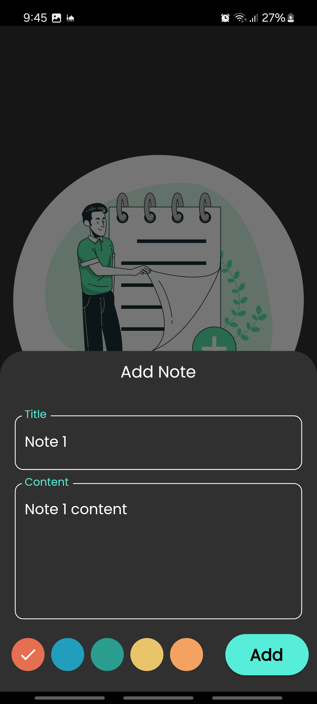

# Notes App 📝

A Flutter app for creating, editing, and storing notes locally. This app uses Hive for efficient local storage and Cubit for state management to ensure a smooth and responsive experience.

## Features
- **Create Notes:** Quickly add new notes with a title and content.
- **Edit and Update Notes:** Easily modify any saved note.
- **Delete Notes:** Remove notes when they are no longer needed.
- **Local Storage:** Notes are stored locally on the device using Hive, making it accessible offline.
- **State Management:** Cubit is used to manage the app's state, ensuring a responsive and organized UI.

## Screenshots
Here's a preview of the app screens:

### Notes List


### Add Note


### empty Notes


| Notes List  | adding note | empty notes |
|---------------|--------------|--------------|
|  |  |  |


```

## Dependencies
- `hive` and `hive_flutter` for local data storage
- `flutter_bloc` for Cubit-based state management
